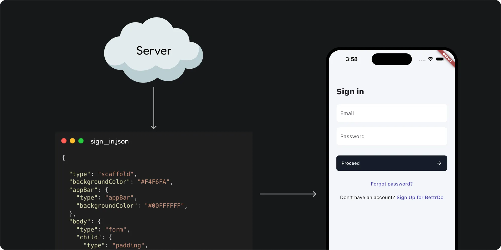

Server-Driven UI (SDUI) is an approach where the server decides the layout and behavior of a screen, and the mobile app simply renders it. When a screen loads, the app fetches a description from the server that specifies which components to display, how to arrange them, and what actions they should perform.

## How is SDUI different from traditional approaches?

In a traditional Client-Driven UI model, the app’s UI is tightly coupled to its codebase. The client handles everything; layouts, business logic, and rendering. Any change, whether updating a button style or adding a new feature, requires modifying code, testing, and submitting a new version to the app stores. This leads to slow release cycles, limited flexibility, and poor scalability.

SDUI flips this model. Instead of hardcoding the UI inside the app, the server determines what the UI should look like. The client’s role is simply to render whatever the server sends.

A helpful analogy is how a browser renders a website. The browser doesn’t know ahead of time what the page contains; it just knows how to interpret and display HTML. Similarly, in SDUI, the app knows how to render predefined components, while the server controls which components appear and how they’re structured.

### How SDUI works:

1. The server defines the UI structure in a lightweight format (usually JSON)
2. The app receives this UI schema and renders it dynamically.
3. To update the UI, you simply change it on the server — the app reflects it instantly, with no app-store release required.

### Pros:

- Rapid deployment without App Store delays
- Reduced app size & complexity
- Platform consistency & faster feature parity
- Accelerated development & cost savings

### Cons:

- Higher implementation complexity (Stac makes this much easier)
- Limited use cases for fully offline applications

## Good Use Cases

- **Home & Explore Sections:** dynamic carousels, promotional modules, editorial stacks
- **Onboarding Flows:** reorder steps, control form elements
- **Paywalls & Offers:** dynamic pricing tables, region-specific plans, time-boxed promotions
- **Feature Flags & Experiments:** real-time A/B testing, targeted rollouts

## Companies actively building with SDUI

Server-Driven UI has gained significant traction in recent years. Both startups and large enterprises now use it extensively.

- **Netflix**
- **Airbnb**
- **Delivery Hero**
- **Uber**
- **Shopify**
- **Meta**
- **Spotify**
- **PhonePe**

## Next steps

- Try the quick start in [Quickstart](./quickstart) to render your first server‑driven screen.
- Read how Stac renders widgets in [Rendering Stac Widgets](./concepts/rendering_stac_widgets).
- Explore the widget catalog under [Widgets](./widgets/).